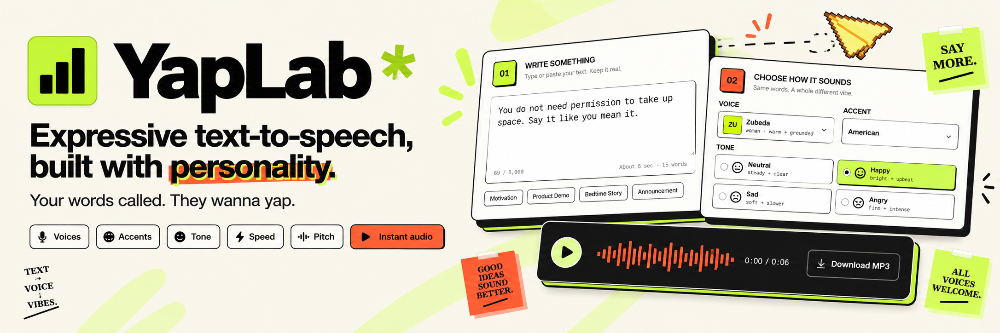
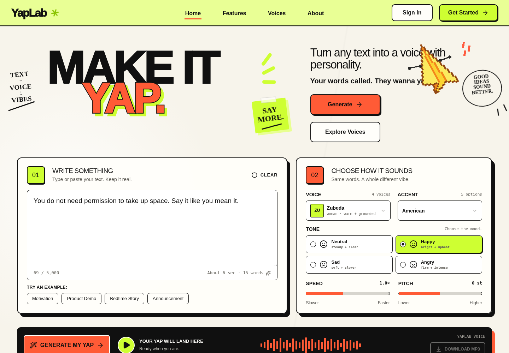
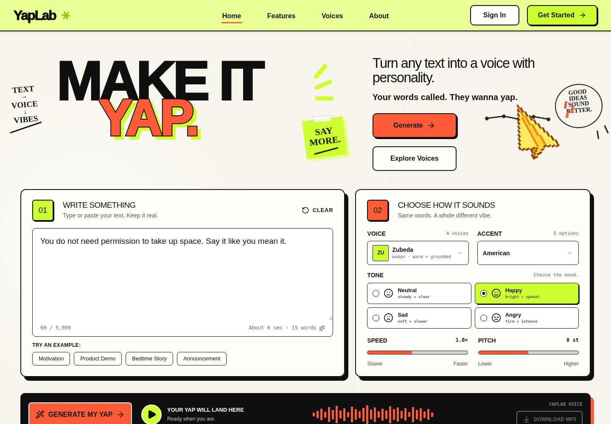
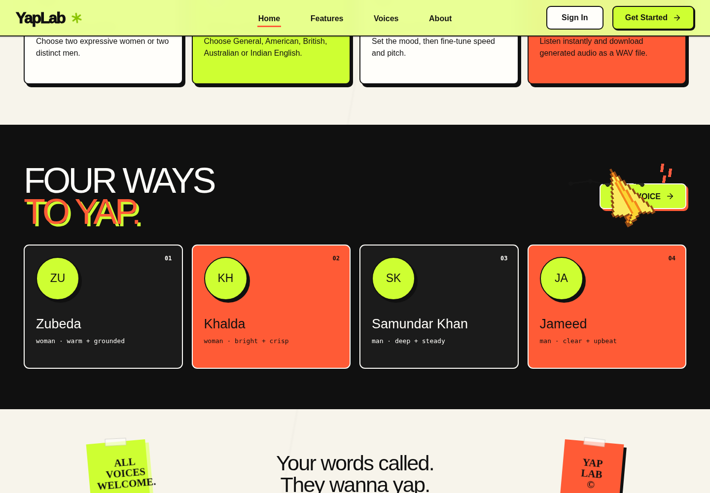
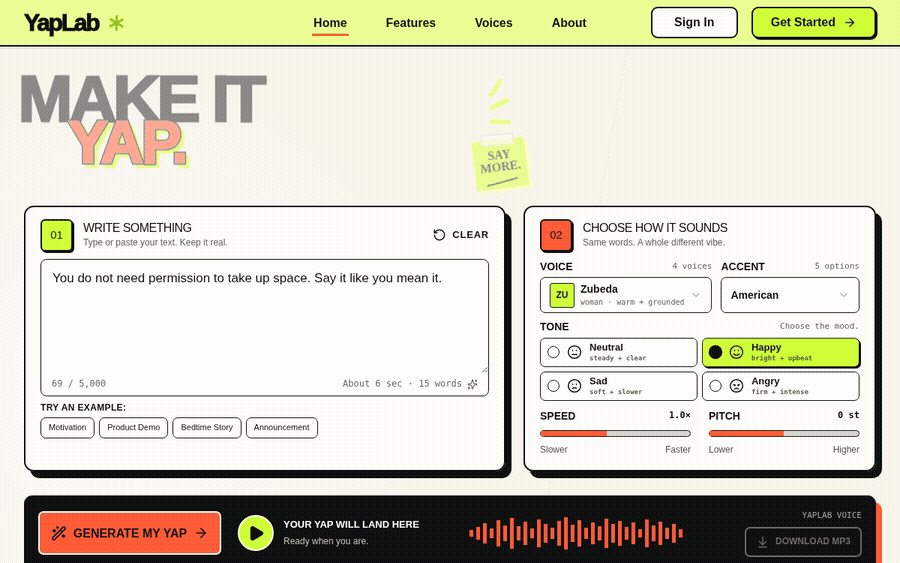
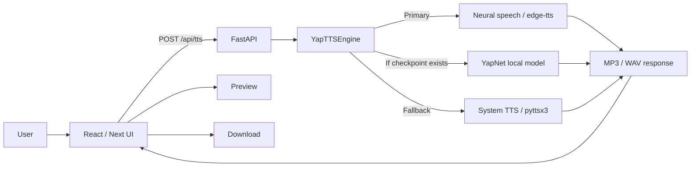

<div align="center">
  
</div>

<div align="center">
  <br />
  
  <h1>YapLab</h1>
  <p><strong>Your words called. They wanna yap.</strong></p>
  <p>
    An expressive text-to-speech studio for turning plain text into voice with personality —
    using selectable voices, accents, emotional tone, speed, pitch, instant playback, and downloadable audio.
  </p>
</div>

<div align="center">

[](https://yaplab-enad40xvi-bluejinnx.vercel.app/)
[](https://github.com/anamta-JINX/YapLap-Text-to-Speech)


</div>

---

## Overview

YapLab is a full-stack text-to-speech application designed around one idea: speech generation should feel like directing a voice, not filling out a form.

The interface gives users a compact studio where they can write or paste up to 5,000 characters, choose one of four named voice personas, switch between English accents, add an emotional tone, fine-tune speed and pitch, generate audio, preview the result, and download it as MP3 or WAV depending on the active synthesis engine.

The repository is intentionally split into a modern React-based frontend, a FastAPI backend, an optional local experimental TTS model, and a separate training area. A root-level `app.py` ties the application together and can build the frontend when needed before serving the UI and API from one local process.

> **Live deployment:** https://yaplab-enad40xvi-bluejinnx.vercel.app/

## Product preview

The screenshots below are captured from the compiled YapLab frontend included in this project package, preserving the same branding, favicon, layout, studio controls, visual system, and the signature yellow pixel-plane cursor used across the website.

### Hero + studio



### Studio workspace



### Voice showcase



## Demo workflow

The demo below walks through the real YapLab v2.3.0 interface: opening the studio, entering text, entering the generation state, producing a ready-to-play result, and moving into the voice showcase.

<div align="center">
  
</div>

For the higher-quality recording with audio, open [`docs/assets/yaplab-demo.mp4`](docs/assets/yaplab-demo.mp4).

---

## What YapLab does

| Capability | Implementation |
| --- | --- |
| Text input | Up to 5,000 characters with word count and approximate duration |
| Voice personas | Zubeda, Khalda, Samundar Khan, and Jameed |
| Accent control | General, American, British, Australian, and Indian English |
| Emotional tone | Neutral, Happy, Sad, and Angry |
| Fine tuning | Adjustable speaking speed and pitch |
| Speech generation | Neural online speech first, then optional local YapNet, then system voice fallback |
| Playback | In-browser audio preview with animated waveform state |
| Export | Download generated MP3 or WAV audio |
| Local launch | One root command through `python app.py` |
| Deployment | Vercel configuration included at repository root |

## Voice system

YapLab exposes four branded personas rather than a list of raw provider voice IDs:

| Persona | Character |
| --- | --- |
| **Zubeda** | Woman · warm + grounded |
| **Khalda** | Woman · bright + crisp |
| **Samundar Khan** | Man · deep + steady |
| **Jameed** | Man · clear + upbeat |

Each persona maps to an accent-appropriate neural speaker. The backend also modifies rate, pitch, and volume based on the selected emotional tone so that the same sentence can be delivered with noticeably different direction.

## Architecture



### Request lifecycle

1. The user writes text and configures voice, accent, emotion, speed, and pitch in the frontend studio.
2. The browser submits a validated JSON request to `POST /api/tts`.
3. `YapTTSEngine` attempts the neural speech path first.
4. If neural speech is unavailable and a trained checkpoint exists, YapLab can attempt the local YapNet path.
5. If neither is available, the backend falls back to an installed system voice through `pyttsx3`.
6. The generated audio is returned with `X-YapLab-Engine` and `X-YapLab-Format` response headers.
7. The frontend creates an audio object URL for playback and enables the download action.

## Tech stack

### Frontend

- React 19
- Next.js 16 application structure
- Vinext + Vite build pipeline
- Tailwind CSS 4
- TypeScript
- Radix/Base UI primitives
- Lucide icons
- Custom YapLab neo-brutalist visual system

### Backend

- Python 3.10+
- FastAPI
- Uvicorn
- Pydantic
- `edge-tts` for the primary neural speech path
- `pyttsx3` for the system voice fallback

### Optional model / training stack

- PyTorch / torchaudio when training dependencies are installed
- Compact experimental `YapNet` architecture
- Separate dataset preparation and training scripts
- Local checkpoint target: `models/yaplab_emotion_tts.pt`

> The optional YapNet path is an experimental local model. The repository does **not** present random or untrained weights as a production TTS model.

---

## Quick start

### 1. Clone the repository

```bash
git clone https://github.com/anamta-JINX/YapLap-Text-to-Speech.git
cd YapLap-Text-to-Speech
```

### 2. Create and activate a Python environment

**Windows / PowerShell**

```powershell
python -m venv .venv
.\.venv\Scripts\Activate.ps1
```

**macOS / Linux**

```bash
python3 -m venv .venv
source .venv/bin/activate
```

### 3. Install runtime dependencies

```bash
python -m pip install -r requirements.txt
```

### 4. Start YapLab

```bash
python app.py
```

Then open:

```text
http://127.0.0.1:8000
```

The packaged project already includes a compiled frontend. If the frontend source is newer than the compiled build, `app.py` checks for Node.js and a package manager, installs missing frontend dependencies when necessary, rebuilds the frontend, and then starts the application.

## Frontend development

YapLab requires Node.js `22.13+` for the current frontend toolchain.

```bash
cd frontend
pnpm install
pnpm dev
```

Useful commands:

```bash
pnpm dev      # frontend development server
pnpm build    # production frontend build
pnpm lint     # lint the frontend source
```

If `pnpm` is unavailable, the root launcher can fall back to `npm` during an automatic rebuild.

## Backend development

The backend application factory lives in `backend/main.py`, and the API router is in `backend/api/routes.py`.

Run the integrated app:

```bash
python app.py
```

Or work directly with the ASGI app from Python if needed:

```python
from pathlib import Path
from backend.main import create_application

app = create_application(Path.cwd())
```

---

## API

### Health

```http
GET /api/health
```

Example response:

```json
{
  "status": "ok",
  "engine": "YapLab Neural",
  "checkpoint_loaded": false
}
```

### Voice metadata

```http
GET /api/voices
```

Returns the available YapLab personas, emotions, and accents.

### Generate speech

```http
POST /api/tts
Content-Type: application/json
```

Example request:

```json
{
  "text": "Your words called. They wanna yap.",
  "voice": "zubeda",
  "emotion": "happy",
  "accent": "american",
  "speed": 1.0,
  "pitch": 0
}
```

The response body is audio. YapLab also returns:

```text
X-YapLab-Engine: <engine used>
X-YapLab-Format: mp3 | wav
```

Example with `curl`:

```bash
curl -X POST http://127.0.0.1:8000/api/tts \
  -H "Content-Type: application/json" \
  -d '{
    "text":"Your words called. They wanna yap.",
    "voice":"zubeda",
    "emotion":"happy",
    "accent":"american",
    "speed":1.0,
    "pitch":0
  }' \
  --output yaplab-output.mp3
```

---

## Project structure

```text
YapLab/
├── app.py                         # integrated local launcher
├── README.md                      # project documentation
├── LICENSE                        # proprietary / all-rights-reserved license
├── vercel.json                    # Vercel build + function configuration
│
├── backend/
│   ├── main.py                    # FastAPI application factory
│   ├── api/
│   │   ├── routes.py              # health, voices and TTS endpoints
│   │   └── schemas.py             # request validation
│   ├── core/
│   │   └── settings.py            # project paths and settings
│   ├── ml/
│   │   ├── tokenizer.py           # text normalization / token sequence
│   │   └── yapnet.py              # compact experimental TTS model
│   └── services/
│       └── tts_engine.py          # synthesis orchestration and fallbacks
│
├── frontend/
│   ├── app/                       # app shell, metadata and global theme
│   ├── components/
│   │   ├── yaplab/                # branded page + studio components
│   │   └── ui/                    # reusable UI primitives
│   ├── data/
│   │   └── studio.ts              # personas, accents, tones and examples
│   ├── public/
│   │   └── favicon.svg            # official YapLab favicon
│   └── package.json               # frontend scripts and dependencies
│
├── training/
│   ├── config.json                # optional training configuration
│   ├── dataset.py                 # training dataset utilities
│   ├── prepare_datasets.py        # preprocessing entry point
│   └── train.py                   # optional model training
│
├── models/                        # optional local checkpoints
├── data/                          # local dataset workspace
├── tests/                         # backend / engine tests
└── docs/
    ├── datasets.md                # dataset notes
    └── assets/                    # README banner, screenshots and demo media
```

## Optional training workflow

The runtime application and the experimental training stack are intentionally separated so that normal users do not need the heavier ML dependencies.

Install the training dependencies only when needed:

```bash
python -m pip install -r requirements-training.txt
```

Prepare datasets:

```bash
python -m training.prepare_datasets \
  --ljspeech data/raw/ljspeech \
  --ravdess data/raw/ravdess
```

Train:

```bash
python -m training.train --config training/config.json
```

The expected checkpoint location is:

```text
models/yaplab_emotion_tts.pt
```

See [`docs/datasets.md`](docs/datasets.md) for dataset notes and the intended lightweight experimentation path.

---

## Deployment

The repository includes a root `vercel.json` configured to build the frontend and package the Python application as a Vercel function while excluding training-only and development-heavy files from the serverless bundle.

Current deployment:

**https://yaplab-enad40xvi-bluejinnx.vercel.app/**

The Vercel build command installs the pinned frontend package manager and generates the production frontend before deployment.

## Testing

Run the Python tests from the repository root:

```bash
python -m pytest -q
```

For frontend quality checks:

```bash
cd frontend
pnpm lint
pnpm build
```

## Design language

YapLab uses a custom retro-professional, Gen-Z neo-brutalist visual direction built around:

- cream / off-white surfaces
- heavy black outlines and offset shadows
- signature lime and coral accents
- oversized editorial typography
- doodle-style annotations and stickers
- a branded pixel paper-plane cursor treatment
- compact studio controls designed to feel playful without looking unfinished

The official favicon remains at [`frontend/public/favicon.svg`](frontend/public/favicon.svg). The README banner and preview media intentionally reuse the same color system and identity rather than introducing a separate documentation brand.

## Operational notes

- The primary neural speech path requires network access while generating audio.
- No API key is required by the current default `edge-tts` integration.
- A local YapNet checkpoint is optional; YapLab remains usable without one when a supported speech path is available.
- System fallback quality and available voices depend on the operating system and installed speech engine.
- On Linux, an installed speech synthesizer such as `espeak` / `espeak-ng` may be required for the final offline fallback.

---

## License

**YapLab is proprietary software.**

Copyright © 2026 **Anamta Gohar**. All rights reserved.

No public license is granted to copy, modify, redistribute, sublicense, sell, rebrand, commercially exploit, host, or create derivative works from YapLab without prior written permission from Anamta Gohar. Third-party dependencies remain governed by their respective licenses.

See [`LICENSE`](LICENSE) for the complete terms.

## Author

<div align="center">
  
  <br /><br />
  <strong>Anamta Gohar</strong><br />
  Creator & Developer of YapLab
  <br /><br />
  <a href="https://github.com/anamta-JINX">GitHub</a>
  ·
  <a href="https://anamtasportfolio.netlify.app/">Portfolio</a>
  ·
  <a href="https://yaplab-enad40xvi-bluejinnx.vercel.app/">Live YapLab</a>
</div>

---

<div align="center">
  <strong>YapLab</strong><br />
  <strong>Your words called. They wanna yap.</strong>
</div>
